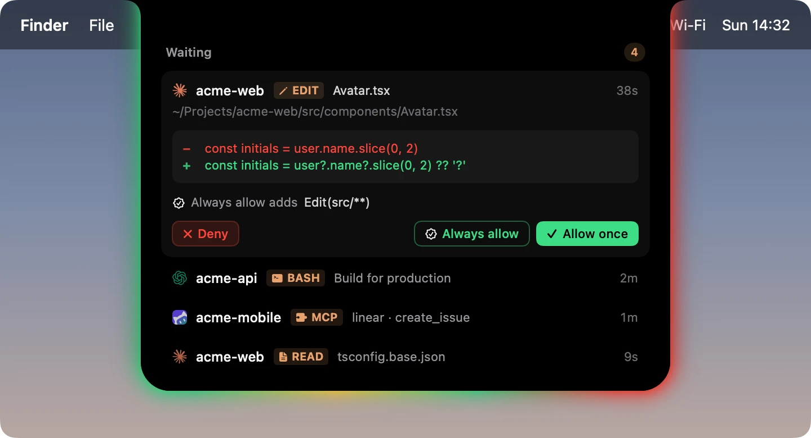
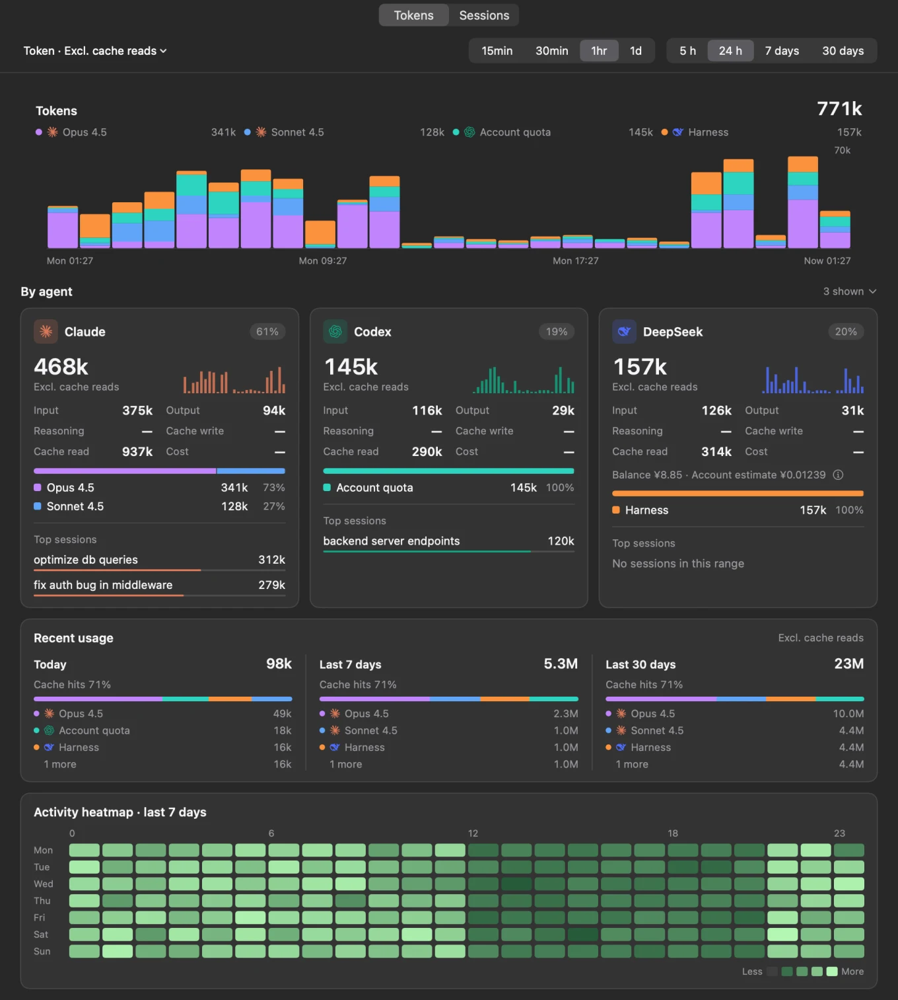
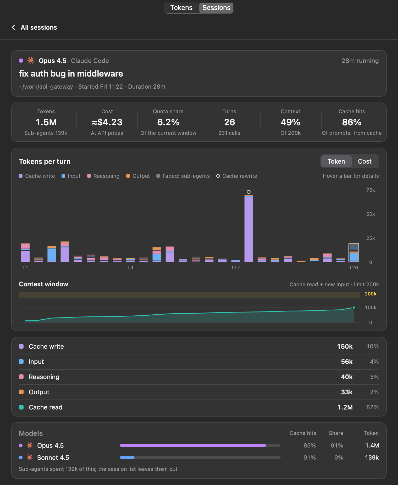
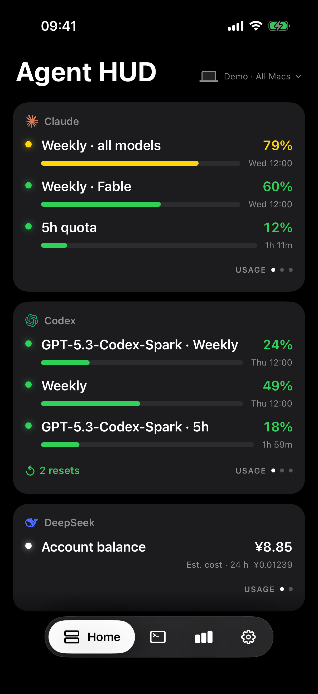
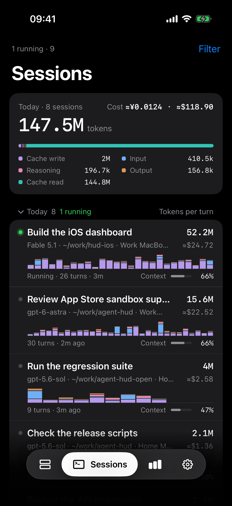

<h1 align="center">Agent HUD Open</h1>
<p align="center"><a href="README.md">English</a> · <strong>简体中文</strong></p>
<p align="center">
  <strong>智能体状态，一眼即知。</strong><br>
  运行状态、额度、令牌和会话，尽在 Mac 刘海或 Dynamic Dock。
</p>

<p align="center">
  <a href="https://agenthud.app/mac"></a>
  <a href="https://apps.apple.com/app/id6812113619"></a>
  <a href="#从源码构建"></a>
</p>

<p align="center">
  <a href="https://agenthud.app">官网</a> ·
  <a href="#本机与远程">本机与远程</a> ·
  <a href="#支持的客户端">支持的客户端</a> ·
  <a href="#文档">文档</a><br>
  <sub>原生 macOS 14+ &nbsp;·&nbsp; Swift 6 &nbsp;·&nbsp; Apache-2.0</sub>
</p>

<p align="center">
  
</p>

Agent HUD Open 是 [Agent HUD](https://agenthud.app) 的 macOS 核心与独立源码版。本机监测免费。官方 Agent HUD 应用还可连接 iPhone 和 Apple Watch。

## 在 Mac 上

| 保持工作流畅 | 了解用量 | 跟进会话 |
| --- | --- | --- |
| 鼠标悬停在刘海上即可查看概览。Dynamic Dock 可在任意显示器上拖到四条屏幕边缘之一。 | 查看套餐额度、重置时间、消耗速率和 API 余额。按模型、令牌种类和时间查看用量。 | 按客户端和项目浏览、搜索会话。Git 仓库及其工作树归入同一项目组。 |
| 接收单轮完成提醒、额度警告和重置通知，直接在 HUD 中回答受支持的审批与问题。 | HUD 固定以 15 分钟柱状图展示过去 24 小时的令牌用量，下方最多列出五个近期或活跃会话。 | 查看每轮用量、上下文和缓存详情，包括已识别的 Codex 子代理。返回受支持客户端的对话或已有终端窗格。 |

选择显示的智能体和账号、各显示器上的位置，以及柔和光效、半色调、字符画、方块、盲文或二进制效果。按 **⌘⌥H** 切换光效。

### 无需切换窗口即可审批

回答前可检查命令、文件、工具输入或编辑差异。Claude Code、Codex、Antigravity 等受支持客户端仍掌控各自的权限流程，可选操作取决于客户端。Claude Code、ZCode 及兼容的 DeepSeek Harness 宿主提出的问题，也可直接在 HUD 中回答。

<p align="center">
  
</p>

### 查看令牌用在了哪里

比较模型、检查会话轮次、跟踪缓存用量和查看活动热力图。按公开 API 价格计算的费用是估算值，与订阅额度及实际账号余额分别显示。

<p align="center">
  <a href="docs/screenshots/usage-statistics.webp"></a> <a href="docs/screenshots/mac-session.webp"></a><br>
  <sub>Mac 用量面板与会话详情 · 示例数据</sub>
</p>

## 本机与远程

| 连接方式 | 可用功能 | 使用条件 |
| --- | --- | --- |
| **本机 Mac** | 监测本机运行状态、额度、令牌和会话，使用 HUD、统计、审批和提醒。 | 免费，无需 Agent HUD 账号或订阅。Agent HUD Open 和官方 Mac 应用均提供。 |
| **本地网络 · 测试版** | 手机扫描二维码与 Mac 配对，在同一网络内只读查看。 | 官方 Mac 应用与兼容的测试版客户端。本地配对无需 Agent HUD Remote 订阅。 |
| **Agent HUD Remote** | 在 iPhone 上集中查看多台 Mac，阅读共享的近期对话，通过小组件、实时活动及配对的 Apple Watch 跟进额度和会话。 | 官方 Mac 应用提供付费远程访问。iPhone 和 Apple Watch 应用可免费下载。 |

> [!IMPORTANT]
> **Mac 测试版要求 iPhone 版 Agent HUD Remote 1.5 或更新版本。** 安装 Mac 测试版前请先更新 iPhone 应用；若 App Store 尚未提供 1.5，请使用对应的 TestFlight 构建。新版测试版已包含网络恢复修复。早期 Mac 测试版 0.4.37 和 0.4.38 存在严重通信问题，请查看[发行说明](https://github.com/jazzenchen/agent-hud-open/releases)。

从 [App Store 获取 Agent HUD](https://apps.apple.com/app/id6812113619)，适用于 **iPhone 和 Apple Watch**。需要 iOS 17+ 和 watchOS 10+；自动实时活动需要 iOS 18+，Apple Watch 智能叠放需要 watchOS 11+。远程查看要求 Mac 与 iPhone 的系统设置使用同一 Apple 账户；Apple Watch 使用配对的 iPhone。

<p align="center"><a href="docs/screenshots/iphone-home.webp"></a> <a href="docs/screenshots/iphone-sessions.webp"></a><br>
  <sub>iPhone 上的 Agent HUD Remote · 首页与会话 · 示例数据</sub>
</p>

本仓库的源码版提供本机 Mac 功能。设备连接和推送服务由官方 Agent HUD 应用提供。套餐详情见 [Agent HUD Remote](https://agenthud.app/#pricing)。

## 支持的客户端

**Claude Code** · **Codex Desktop / CLI** · **DeepSeek Harness** · **Antigravity** · **Cursor** · **Grok CLI** · **Grok Bot** · **GitHub Copilot CLI** · **OpenCode** · **Kimi** · **GLM** · **Pi** · **OpenClaw** · **Hermes Agent** · **ZCode** · **CodeBuddy** · **WorkBuddy** · **Qwen Code**

安装并登录想要监测的客户端。运行状态、额度、余额和跳转支持因客户端及账号而异。Grok CLI 与 Grok Bot 在 Grok 账号下分别显示独立客户端条目和图标；Grok Bot 读取可用的本地对话缓存，这些缓存可能不完整，也不能据此判断实时状态。

详见[提供方支持](docs/providers.md)、[会话生命周期](docs/session-lifecycle.md)和[会话跳转](docs/session-navigation.md)。**Qoder** 构建也支持审批钩子；支持的选项与问题见 [HUD 审批](docs/hud.md#approvals)。

### 你的数据

本机监测读取 Mac 上各客户端的记录。受支持的额度与余额查询使用已安装客户端现有的登录状态或已配置的凭据；报告及存储的用量数据不包含这些凭据。源码版将用量历史保存在本机。详见[数据访问](docs/data-access.md)与官方应用的[隐私政策](https://agenthud.app/privacy?lang=cn)。

## 从源码构建

**环境要求：** macOS 14+，以及包含 Swift 6 工具链的 Xcode 或 Xcode 命令行工具。

```sh
git clone https://github.com/jazzenchen/agent-hud-open.git
cd agent-hud-open
make check
make test
make run
```

以上命令会构建并打开 `build/Agent HUD Open.app`，使用临时签名供本机运行，无需开发者账号、签名身份或配置描述文件。

<details>
<summary><strong>开发与嵌入</strong></summary>

| 命令 | 用途 |
| --- | --- |
| `make check` / `make test` | 检查源码边界／运行单元测试 |
| `make build` / `make run` | 构建本机签名应用／构建并打开应用 |
| `make demo` / `make snapshot` | 打开示例数据／将界面渲染到 `build/snapshots` |

Swift 包提供 `AgentHUDSupport`（记录与身份）、`AgentHUDCore`（提供方、模型与存储）和 `AgentHUDDesktop`（原生 HUD 与统计）。`AgentHUDOpen` 是独立可执行程序。宿主可通过 `DesktopApplication` 提供设置页面与服务，详见[宿主集成](docs/architecture.md#host-integration)。

持续集成检查源码边界、运行单元测试、构建应用，并验证签名与资源。

</details>

## 文档

[HUD 与审批](docs/hud.md) · [提供方](docs/providers.md) · [用量语义](docs/usage-semantics.md) · [会话生命周期](docs/session-lifecycle.md) · [会话跳转](docs/session-navigation.md) · [数据访问](docs/data-access.md) · [架构](docs/architecture.md) · [性能](docs/performance.md) · [命令行](docs/command-line.md) · [更新](docs/updates.md) · [品牌素材](docs/brand-assets.md) · [变更记录](CHANGELOG.md)

## 许可证

[Apache-2.0](LICENSE)。提供方引用与图标素材保留其[第三方声明](THIRD_PARTY_NOTICES.txt)及[图标许可](Sources/AgentHUDDesktop/Resources/LobeIcons-LICENSE.txt)。
